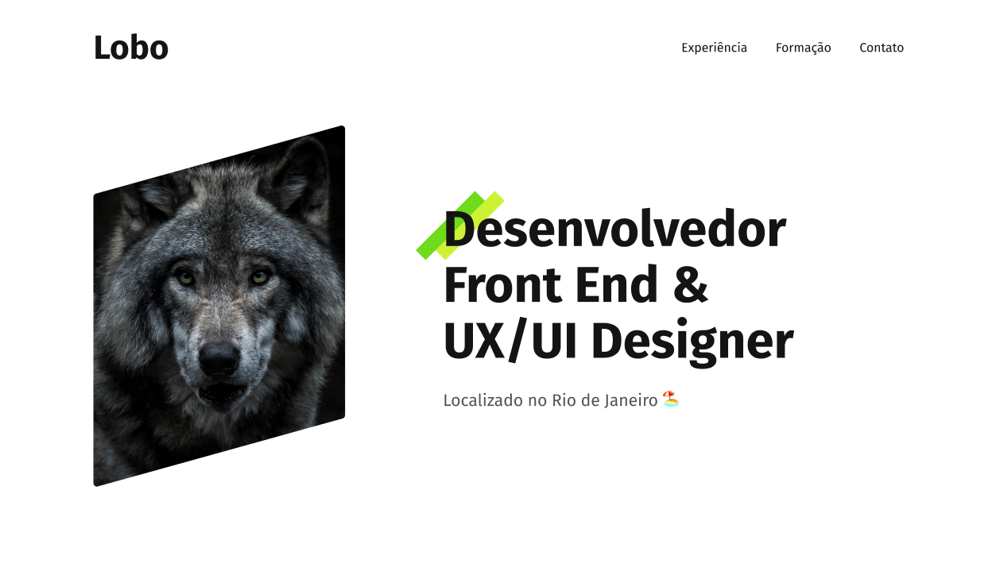

<h1 align="center"> Portifólio </h1>

Portifólio do curso Origamid.

  <a href="#-tecnologias">Tecnologias</a>&nbsp;&nbsp;&nbsp;|&nbsp;&nbsp;&nbsp;
  <a href="#-projeto">Projeto</a>&nbsp;&nbsp;&nbsp;|&nbsp;&nbsp;&nbsp;
  <a href="#-layout">Layout</a>&nbsp;&nbsp;&nbsp;|&nbsp;&nbsp;&nbsp;
  <a href="#-autora">Autora</a>

 

  

## 🚀 Tecnologias

Esse projeto foi desenvolvido com as seguintes tecnologias:

- HTML
- CSS

## 💻 Projeto

Um exemplo de portifóilo mostrando suas experiências e formações.

## 🔖 Layout

Você pode visualizar o layout do projeto através [DESSE LINK](https://www.figma.com/file/0eNpq8RbAA3yQBVwOgw74M/projeto-pessoal?node-id=10%3A0&t=HQ7yNW1VPDTCzYo7-0). É necessário ter conta no [Figma](https://figma.com) para acessá-lo.

## 🙋‍♀️ Autora

<h1><a href="https://www.linkedin.com/in/ellen-bessa-081773253/" style="all: unset; cursor:pointer; font-size:20px;"> Ellen Bessa </a></h1>

